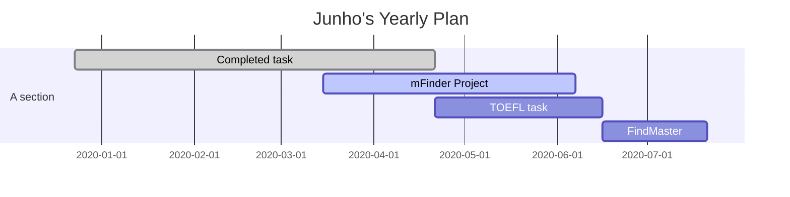

# myYearlyPlan
일년의 계획을 정리해보는 자료

```mermaid
gantt
dateFormat  YYYY-MM-DD
title Junho's Yearly Plan
excludes weekdays 2020-12-31

section A section
Completed task            :done,    des1, 2019-12-23,2020-04-21
mFinder Project               :active,  mfinder, 2020-03-15, 12w
TOEFL task               :         TOEFL, 2020-04-21, 8w
FindMaster               :         findMaster, after TOEFL, 5w
```